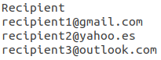

# DataTau.net Scraper

Scrapes and sends DataTau.net top articles by email.

## :boom: Data what?

DataTau.net gathers the most relevant data related articles from a wide variety of websites into one place. It doesn't matter your level of expertise or if you are more into data engineering than data science, you will certainly find something interesting to read and broaden your knowledge. It has a dynamic ranking system which means that most liked articles will be placed first. If you haven't checked it out yet, you should give it a shot [here](https://datatau.net/ "DataTau's Homepage").

However great it might be, this site has some shortcomings. It does not have a newsletter service, for instance. This is where DataTau Scraper comes into play. A python script tackles the problem by scraping the site and sending those top articles by email to any recipient.

<p align="center">
  
</p>

## :wrench: Configuration
### Step 1

Install Python 3.7 and mandatory dependencies listed in the requirements file.

If you are using the Anaconda distribution. Run the following command to create a new environment named "datatau"

```
conda env create -f requirements.yml
```

if you don't happen to be running conda, don't despair. There is also a requirements.txt file you can use to install all necessary modules. Remember to install python first.
```
pip install python
pip install -r requirements.txt
```

**Note:** Environment managers differ from one another. It's strongly recommended to check its documentation.

### Step 2
Once you have everything installed, you need to set the email account that will be sending the list and those who will be receiving it. The sender email must be a gmail account. 

Open datatau.py script and update the following constants at the top of the file:

*USER* -> sender account. Must be gmail.

*PASS* -> sender account's password.

*ER_RECP* -> Email account to notify if something goes awry.

*NUM_ART* -> Number of articles per list. Default 5. Max 30.

<p align="center">
  
</p>

### Step 3
Update recipients.csv file. There is no recipients limit, you can add as many as you want. Add or delete recipients modifying the file data/recipients.csv
This csv file has only one column. Each recipient should be placed in one line. 

<p align="center">
  
</p>

## :snake: Running the script

Run it by typing `python datatau.py` on your terminal. If all settings were set up correctly, recipients should be receiving an email shortly after hitting enter. 

### :file_folder: Folder structure
```
└── project
    ├── .gitignore
    ├── requirements.txt
    ├── requirements.yml
    ├── README.md
    ├── datatau.py
    ├── data
    │   └── recipients.csv
    └── notebooks
        └── DataTau.ipynb
```

## :love_letter: Contact info
Doubts? Advice?  Drop me a line! :smirk:
