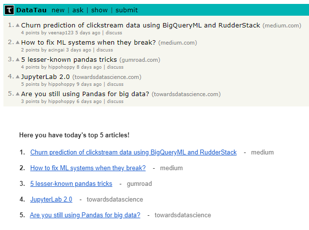
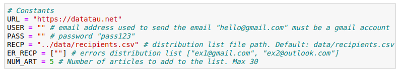

# DataTau.net Scraper

Scrapes and sends DataTau.net top articles by email.

## :boom: Data what?

DataTau.net gathers the most relevant data related articles from a wide variety of websites and puts them in one place. It doesn't matter if your are a rookie or veteran, if you are more into data engineering than data science. You will certainly find something interesting to read and broaden your knowledge. It also has a dynamic ranking system which means that most liked articles will be placed first. If you havent checked it out yet, you should give it a shot.

However great it might be, this page has some shortcomings. It does not have a newsletter service, for instance. This is where DataTau Scraper steps into the action. A simple pyhton script, this scraper address the problem by scraping the site and then sending those top articles to any email of choice.

<p align="center">
  
</p>

## :wrench: Configuration
### Step 1

Install python 3.7 and mandatory dependencies listed in the requirements file.

If you are using the anaconda distribution. Run the following command to create a new environment named "datatau"

```
conda env create -f requirements.yml
```

if you happen not to be running conda, don't despair. There is also a requirements.txt file you can use to install all necessary modules. Remember to install python first.
```
pip install python
pip install -r requirements.txt
```

**Note:** Environment managers differ from one another. It's strongly recommended to check its documentation.

### Step 2
Once you have everything installed, you need to add the email account that will be sending the list and those who will be receiving it. The sender email must be a gmail account. 

Open datatau.py script and update the following constants at the top:

*USER* -> sender account. Must be gmail.

*PASS* -> sender account's password.

*RECP* -> List. Email accounts who will receive email.

*ER_RECP* -> Email account to inform if something goes amiss.

*NUM_ART* -> Amount of articles per email to send. Default 5. Max 30.

<p align="center">
  
</p>

## :snake: Running the script

Run it by typing `python datatau.py` on your terminal. If settings were set up correctly, all recepients should receive and email shortly after hitting enter. 

### :file_folder: Folder structure
```
└── project
    ├── .gitignore
    ├── requeriments.txt
    ├── requeriments.yml
    ├── README.md
    ├── datatau.py
    └── notebooks
        └── DataTau.ipynb
```

## :love_letter: Contact info
Doubts? Advice?  Drop me a line! :smirk:
